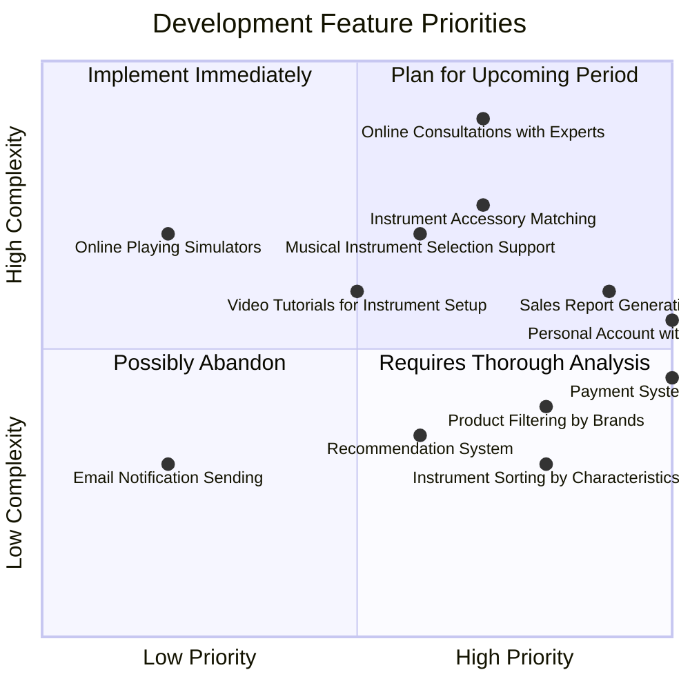

# Интернет-магазин музыкальных инструментов

## Обзор проекта

Это приложение представляет собой современный интернет-магазин музыкальных инструментов с комплексной системой управления товарами, пользователями и заказами.

## Архитектура системы

### Описание архитектуры системы

1. **Клиент**: Пользователи взаимодействуют через веб-сайт или мобильное приложение
2. **API-шлюз**: Централизованная точка входа для всех запросов
3. **Сервисы**:
   - Сервис товаров: Управление каталогом музыкальных инструментов
   - Сервис авторизации: Регистрация и вход пользователей
   - Сервис заказов: Обработка покупок и отслеживание
4. **Базы данных**: Раздельные базы для товаров и пользователей
5. **Интеграции**: 
   - Платежный шлюз для обработки транзакций
   - Система управления складом для отслеживания наличия

## Путешествие пользователя

### Детали путешествия пользователя

Процесс покупки музыкального инструмента разделен на четкие этапы:
1. **Просмотр**: Посещение сайта, поиск инструментов
2. **Выбор**: Изучение деталей, сравнение инструментов
3. **Покупка**: Добавление в корзину, оплата
4. **После покупки**: Подтверждение заказа, отслеживание, оставление отзыва

## Ментальная карта функциональности магазина

### Основные функциональные возможности

Проект включает comprehensive набор функций:
- Широкий каталог музыкальных инструментов
- Удобный пользовательский интерфейс
- Многоуровневая система поддержки клиентов
- Гибкие способы оплаты
- Система персонализированных рекомендаций

## Квадрант-граф

### Стратегическая карта развития проекта

### Пояснения к квадрант-карте

#### Стратегические приоритеты (правый нижний квадрант)
Функции с высокой стратегической ценностью и относительно несложные в реализации:
- **Интеграция платежных систем**
- **Создание персонального аккаунта**
- **Каталогизация с фильтрацией**

#### Высокая сложность (верхний правый квадрант)
Важные, но технически сложные функции:
- **Онлайн-консультации с экспертами для выбора**
- **Генерация отчетов**
- **Реккомендация аксессуаров к товарам**

### Стратегические выводы

Квадрант-анализ помогает команде разработчиков:
- Фокусироваться на наиболее ценных функциях
- Оптимально распределять ресурсы
- Планировать развитие проекта с учетом стратегической важности и технической сложности каждой функции

**Ключевой приоритет**: Разработка пероснального аккаунта, каталогизация товаров и интеграция платежных сервисов.

## Workflow разработки

### Детали workflow разработки

Проект разрабатывается с использованием модели Git Flow:
1. Раздельные ветки для интерфейса, бэкенда и базы данных
2. Последовательная интеграция компонентов
3. Модульный подход к разработке
4. Непрерывная интеграция и тестирование

**Технологический стек**:
- Фронтенд: React
- Бэкенд: Java Spring
- База данных: PostgreSQL + Redis

## Контакты

Для получения дополнительной информации свяжитесь с командой разработчиков.
